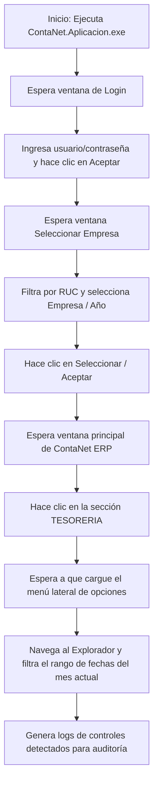

# Carga ContaNet - Automatización de Carga y Explorador

Este proyecto es una herramienta de automatización basada en Python para interactuar de manera automatizada con el software **ContaNet ERP 3.0.7.44 - SOUTHERN** bajo sistemas operativos Windows. Utiliza librerías de automatización de interfaz gráfica (GUI) como `pywinauto` y `pyautogui` para simular acciones del usuario, navegar por menús e ingresar datos.

---

## 📋 Requisitos Previos

Antes de ejecutar la aplicación, asegúrate de contar con los siguientes requisitos en tu entorno local:

1. **Sistema Operativo:** Windows (necesario para `pywinauto` y las APIs de automatización gráfica de Windows).
2. **ERP ContaNet instalado en la ruta:**
   `C:\Ejecutable ContaNet ERP 3.0.7.44 - SOUTHERN\ContaNet.Aplicacion.exe`
3. **Python:** Versión `>= 3.14` (especificada en el proyecto).
4. **Administrador de paquetes Python:** Se recomienda utilizar [uv](https://github.com/astral-sh/uv) para la gestión del entorno virtual y las dependencias de manera rápida.

---

## 🛠️ Instalación y Configuración

Sigue estos pasos para preparar el entorno de ejecución:

### Opción A: Usando `uv` (Recomendado)

Si tienes `uv` instalado, puedes inicializar el entorno y sincronizar las dependencias con un solo comando:

```bash
# Sincronizar el entorno virtual con las dependencias del proyecto
uv sync
```

Esto leerá el archivo `pyproject.toml` e instalará los paquetes requeridos (`pyautogui` y `pywinauto`) en el entorno virtual `.venv`.

### Opción B: Usando `pip` y un Entorno Virtual estándar

Si prefieres usar la herramienta estándar de Python:

```bash
# 1. Crear el entorno virtual
python -m venv .venv

# 2. Activar el entorno virtual
# En PowerShell:
.venv\Scripts\Activate.ps1
# En CMD:
.venv\Scripts\activate.bat

# 3. Instalar las dependencias
pip install -r pyproject.toml
```

---

## ⚙️ Configuración del Script (`main.py`)

Antes de realizar la ejecución, revisa los parámetros configurados en el archivo [main.py](file:///C:/Users/jarana/repositorio/proyect_conta/carga_contanet/main.py). Es posible que desees ajustar variables clave como rutas, credenciales o la empresa a seleccionar.

### 1. Ruta del ERP ContaNet
Si el ejecutable se encuentra en una ubicación distinta, modifica estas variables al inicio de [main.py](file:///C:/Users/jarana/repositorio/proyect_conta/carga_contanet/main.py#L5-L12):
```python
ruta_exe = r"C:\Ruta\A\Tu\ContaNet.Aplicacion.exe"
directorio_trabajo = r"C:\Ruta\A\Tu"
```

### 2. Credenciales de Inicio de Sesión
Por defecto, las credenciales están definidas en [main.py](file:///C:/Users/jarana/repositorio/proyect_conta/carga_contanet/main.py#L66-L68):
* **Usuario:** `COSTOS`
* **Contraseña:** `1234`
*(Nota: Existe un archivo `.env` en la raíz con estas mismas credenciales en caso de que desees integrarlo dinámicamente en el futuro).*

### 3. Selección de Empresa y Año
El script está preconfigurado para seleccionar una empresa y un año específicos. Puedes modificar estos valores en [main.py](file:///C:/Users/jarana/repositorio/proyect_conta/carga_contanet/main.py#L567-L568):
```python
nombre_empresa = "20376729126"  # RUC o nombre de la empresa
anio = "2021"                   # Año contable a abrir
```

---

## 🚀 Cómo Ejecutar la Aplicación

Para iniciar el flujo de automatización, abre tu terminal en la raíz del proyecto y ejecuta:

### Con `uv` (Recomendado)
```bash
uv run main.py
```

### Con el Entorno Virtual Activo
```bash
python main.py
```

---

## 🔄 Flujo de Automatización

Al iniciar, el script realiza la siguiente secuencia de forma automática:



1. **Inicio de la Aplicación:** Abre el ejecutable de ContaNet ERP.
2. **Autenticación:** Completa el formulario de Login y hace clic en "Aceptar".
3. **Selección de Empresa:** Busca la empresa por RUC (`20376729126`), el año (`2021`) y acepta.
4. **Navegación:**
   * Abre la sección de **Tesorería**.
   * Localiza el **Explorador** dentro del panel lateral en árbol (Treeview).
   * Configura las fechas del mes actual de manera automática en los filtros de fecha desde/hasta.
   * Realiza un diagnóstico de los controles y elementos en pantalla y los imprime en consola.

---

## ⚠️ Consideraciones Importantes sobre la Automatización de GUI

Debido a que el script utiliza `pywinauto` y `pyautogui` para controlar los elementos de la interfaz gráfica a nivel de sistema:

* **No muevas el mouse ni uses el teclado** mientras el script está en ejecución. Cualquier interacción del usuario puede interferir con los clics automáticos y fallar el flujo.
* **Mantén la pantalla activa y desbloqueada:** Si la sesión de Windows se bloquea o el monitor se apaga, las APIs de automatización gráfica no podrán ubicar las ventanas y los controles.
* **Resolución y Escalado de Pantalla:** En caso de fallas detectando botones o coordenadas de caída (fallback), asegúrate de que el escalado de pantalla en Windows esté configurado al `100%`.
* **Archivo de Errores:** Las excepciones no controladas o fallas de flujo pueden registrar información en el archivo `Errores.txt`.

---

## 📁 Estructura Clave del Proyecto

* [main.py](file:///C:/Users/jarana/repositorio/proyect_conta/carga_contanet/main.py): Código principal con las funciones de automatización de ventanas, inicio de sesión y navegación.
* [pyproject.toml](file:///C:/Users/jarana/repositorio/proyect_conta/carga_contanet/pyproject.toml): Configuración de dependencias y versión de Python.
* [uv.lock](file:///C:/Users/jarana/repositorio/proyect_conta/carga_contanet/uv.lock): Bloqueo de dependencias para asegurar consistencia del entorno.
* [README.md](file:///C:/Users/jarana/repositorio/proyect_conta/carga_contanet/README.md): Este archivo de documentación.
* `Errores.txt`: Archivo donde se registran errores o logs de fallas previas de la aplicación.
